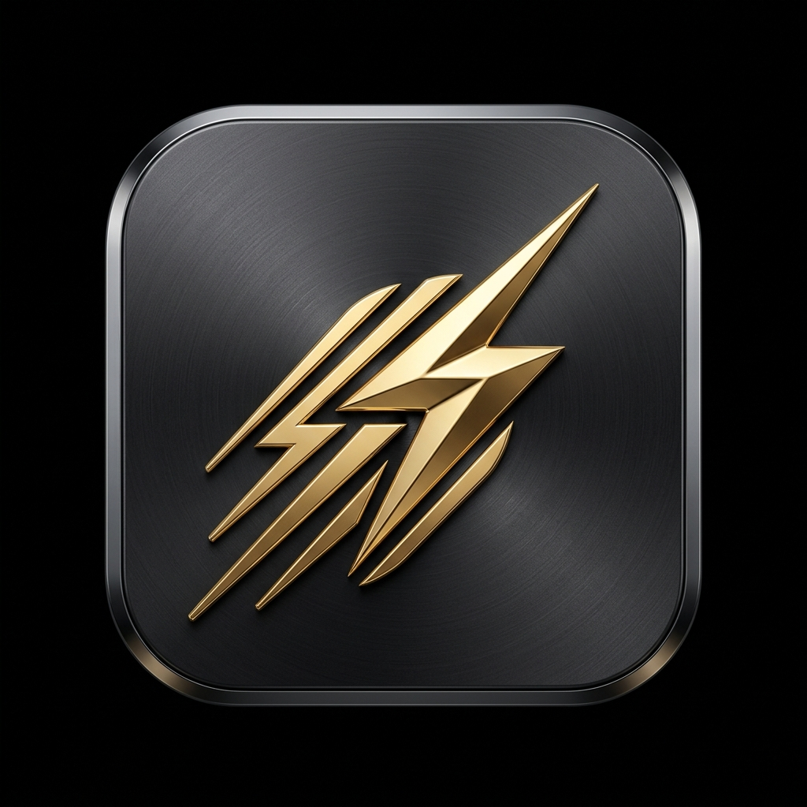
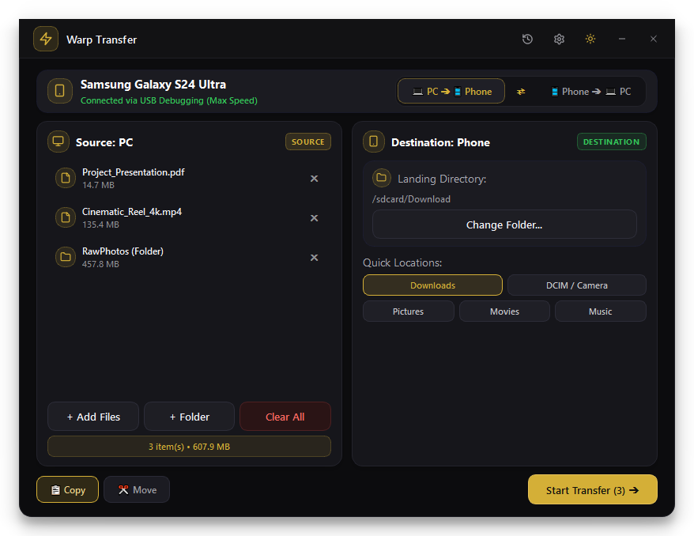
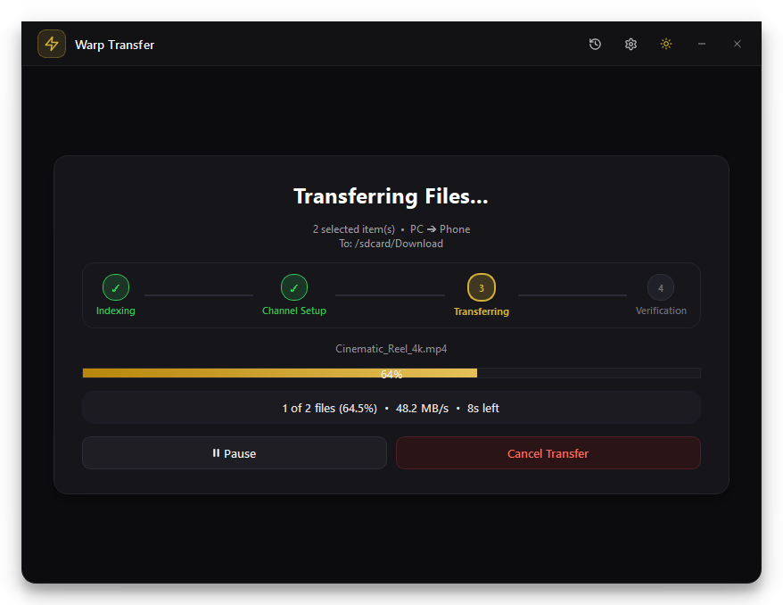
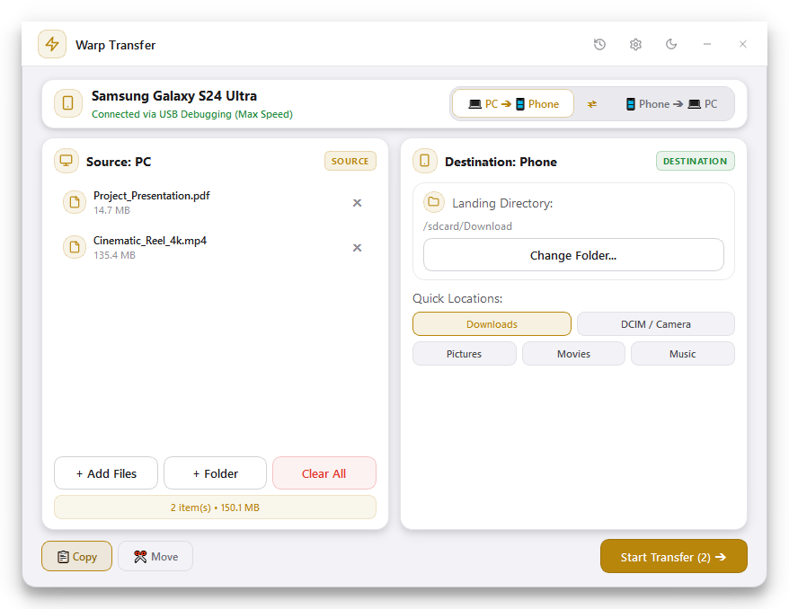
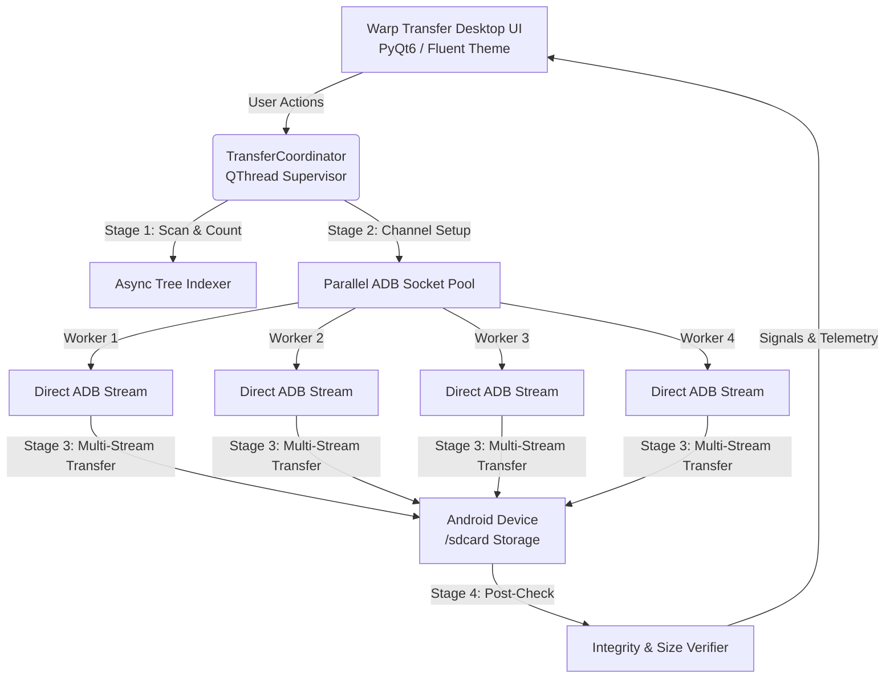

<div align="center">

  

  # ⚡ Warp Transfer
  
  **The ultimate high-speed, bi-directional Android ⇆ PC file transfer powerhouse.**  
  *Bypasses sluggish Windows MTP using parallelized ADB socket streams and a modern fluent desktop UI.*

  [](https://github.com/tahsanahmmed25/warp-transfer/releases/latest)
  [](https://github.com/tahsanahmmed25/warp-transfer)
  [](https://www.python.org/)
  [](https://www.qt.io/)
  [](LICENSE)

  <br />

  <p align="center">
    <a href="#-key-features"><b>Explore Features</b></a> •
    <a href="#-speed--feature-comparison"><b>Performance Comparison</b></a> •
    <a href="#-ui-walkthrough"><b>UI Gallery</b></a> •
    <a href="#-installation"><b>Download & Install</b></a> •
    <a href="#-architecture"><b>Architecture</b></a> •
    <a href="#-trust--security"><b>Security & FAQ</b></a>
  </p>

  <br />

  

</div>

---

## 💡 Why Warp Transfer?

Standard Windows file transfer for Android relies on **Media Transfer Protocol (MTP)** — a legacy protocol introduced in 2004 that suffers from severe design limitations:

* 🛑 **Single-Threaded Bottleneck:** Transfers 10,000 photos serially one by one, often locking up or timing out.
* 🛑 **Random Freezes & Disconnects:** Interrupts your copy operation midway, leaving you guessing which files were actually copied.
* 🛑 **Hidden & Missing Files:** Explorer frequently fails to enumerate newly created media until the device cache updates.

**⚡ Warp Transfer eliminates MTP entirely.** By establishing direct, parallel multi-channel socket connections through Google's official **Android Debug Bridge (ADB)**, Warp Transfer moves files and folders at native hardware wire speeds.

---

## 📊 Speed & Feature Comparison

| Feature / Metric | ⚡ Warp Transfer (ADB Engine) | 🐌 Windows Explorer (MTP) | 📡 LocalSend (Local Wi-Fi) | 🔵 Bluetooth |
| :--- | :---: | :---: | :---: | :---: |
| **Transfer Engine** | **Parallel ADB Sockets (Multi-Worker)** | Serial MTP Driver | Local Wi-Fi HTTP/TLS | Bluetooth RFCOMM |
| **Small Files (10k Photos)** | **⚡ 15–25x Faster** | 🐢 Sluggish / Frequent Hangs | 🚀 Fast (Wi-Fi Bound) | ❌ Impractical |
| **Bi-Directional Support** | **✅ PC ➔ Phone & Phone ➔ PC** | ✅ Read / Write | ✅ Device ⇆ Device | ✅ Slow |
| **Zero-Freeze Progress Stepper** | **✅ 4-Stage Real-Time Pipeline** | ❌ Opaque Indeterminate | ❌ Simple Progress | ❌ Basic |
| **Large Folder Deep Traversal** | **✅ Non-blocking async tree index** | ❌ Freezes Explorer | ✅ Recursive | ❌ Manual |
| **Wireless Wi-Fi Pairing** | **✅ Android 11+ Pairing Code & IP** | ❌ USB Cable Only | ✅ Wi-Fi Network | ❌ Slow |
| **Auto Integrity Validation** | **✅ Byte & Size Verification** | ❌ No Verification | ✅ Checksums | ❌ None |

---

## ✨ Key Features

### 🔄 Top Direction Switcher & 1-Click Swap
- Seamlessly toggle between **`💻 PC ➔ 📱 Phone`** and **`📱 Phone ➔ 💻 PC`**.
- Instant direction swap button (`⇄`) automatically synchronizes and inverts source/destination cards in real-time.

### 📂 Split Two-Column Staging Workspace
- **Drag & Drop Anywhere:** Drop files and entire directory trees straight into the left staging area.
- **Interactive Staged List:** Scrollable file cards with custom vector badges, truncated names with path tooltips, formatted sizes, individual item removal (`✖`), and a live storage summary pill (`3 item(s) • 607.9 MB`).
- **Flexible Batch Ingestion:** Add files incrementally across multiple Explorer windows before starting your transfer.

### 🎯 Custom Landing Directory & Quick Location Chips
- Choose arbitrary target folders using native file dialogs (`PhoneFolderPickerDialog` on Android / `QFileDialog` on PC).
- **1-Click Quick Chips:** Fast navigation presets for common paths (`Downloads`, `DCIM / Camera`, `Pictures`, `Movies`, `Music`, `Desktop`, `Videos`, `Warp Backup`).

### 🚀 4-Stage Stepper Zero-Freeze Pipeline
Eliminates UI freeze perception by breaking the transfer lifecycle into four distinct animated milestones:
1. **Indexing**: Scans selected files/directories and calculates total byte volume asynchronously.
2. **Channel Setup**: Initializes and opens 4 parallel ADB socket stream channels.
3. **Transferring (Streaming)**: Displays active filename ticker, progress bar, real-time speed (`MB/s`, `KB/s`), countdown ETA, and Pause/Cancel controls.
4. **Verification**: Validates file integrity on the target destination before confirming completion.

### 📋 Non-Destructive Copy vs. Fast Move
- Choose between non-destructive **`📋 Copy`** and **`✂️ Move`** with explicit safety warnings.
- **Zero Data Loss Guarantee:** Source files are *only* removed during a Move operation after destination bytes are 100% verified.

### 🌐 Wireless Wi-Fi ADB Connection
- Ditch the USB cable! Connect wirelessly via Wi-Fi with Android 11+ Pairing Code handshakes or standard TCP/IP port reconnection.

### 🎨 Handcrafted Fluent Design System
- Available in both **Dark Mode** and **Light Mode** with soft layered drop shadows, rounded icon badges, and smooth cross-fade page animations.

---

## 📸 UI Gallery

<div align="center">

### 🌙 Dark Mode Dashboard & Interactive Staging


### 🚀 4-Stage Stepper & Live Telemetry Stream


### ☀️ Light Mode Fluent Theme


</div>

---

## 📦 Installation

### Option 1: Official Windows Installer (Recommended)
1. Head over to the **[Latest Release](https://github.com/tahsanahmmed25/warp-transfer/releases/latest)**.
2. Download **`Warp-Transfer-Setup.exe`**.
3. Run the installer — it installs directly into your user local AppData (requires **no administrator/UAC privileges**).

### Option 2: Run from Source (Developers)

```bash
# 1. Clone the repository
git clone https://github.com/tahsanahmmed25/warp-transfer.git

# 2. Navigate to directory
cd warp-transfer

# 3. Install required dependencies
pip install -r requirements.txt

# 4. Launch Warp Transfer
python main.py
```

> **Note:** On first launch, Warp Transfer will automatically download and configure Google's official Android platform tools (`adb.exe`) if not already present on your system.

---

## 🏗️ Architecture



---

## 🛡️ Trust & Security

Because Warp Transfer bundles and interacts with the official Google Android Debug Bridge (`adb.exe`) to communicate with connected devices over USB/Wi-Fi, **some antivirus software (like Windows Defender SmartScreen) may flag unsigned newly compiled executables as a false positive.**

* **Why does this happen?** Antivirus heuristic scanners flag applications that interface with low-level USB devices or spawn developer background daemons (`adb.exe`).
* **100% Open Source:** Warp Transfer is fully transparent under the **MIT License**. There are no background telemetry trackers, telemetry analytics, or network phoning. All file operations execute 100% locally on your hardware.

---

## 🤝 Contributing

Contributions, issues, and feature requests are welcome! Feel free to check the [Issues page](https://github.com/tahsanahmmed25/warp-transfer/issues).

1. Fork the Project
2. Create your Feature Branch (`git checkout -b feature/AmazingFeature`)
3. Commit your Changes (`git commit -m 'feat: Add some AmazingFeature'`)
4. Push to the Branch (`git push origin feature/AmazingFeature`)
5. Open a Pull Request

---

## 📄 License

Distributed under the **MIT License**. See [`LICENSE`](LICENSE) for more information.

<div align="center">
  <sub>Crafted with precision by <b><a href="https://github.com/tahsanahmmed25">Tahsan Ahmmed</a></b></sub>
</div>
